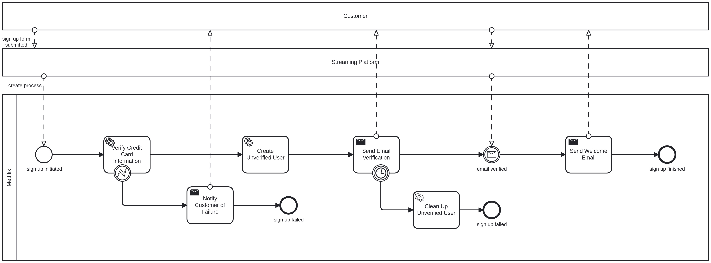

# Demo

The demo will deploy the [sign-up-process.bpmn](./sign-up-process.bpmn) process, modeling a user sign up flow for the 
premiere German cooking streaming service, Mettflix. This project provides deployment files to set up and operate the 
demo application - _not the C8 cluster!_

## Pre-requisites

The demo application reuses building blocks from the [camunda/camunda](https://github.com/camunda/camunda) repository,
as well as the publicly available [benchmark Helm chart](https://github.com/zeebe-io/benchmark-helm.git).

You will need:

- Helm 3.14+ installed
- Docker 27+

Helm is used to deploy the demo application, and Docker is used to build custom application images.

