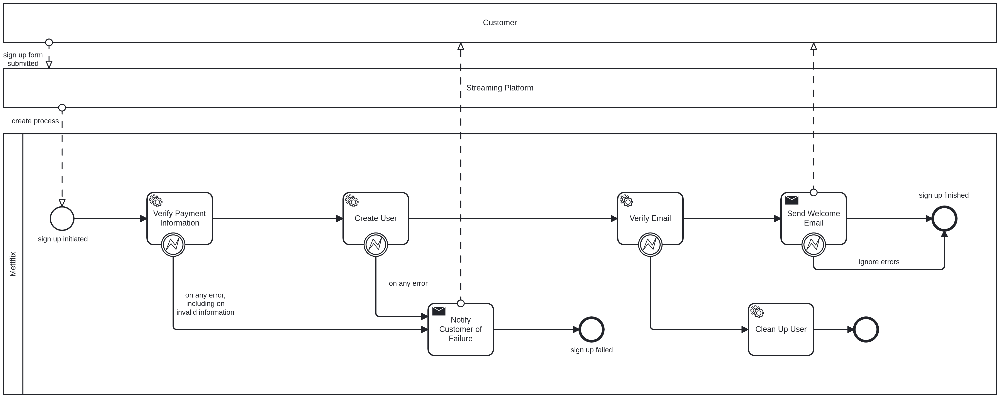

# Demo

The demo will deploy the [sign-up-process.bpmn](./sign-up-process.bpmn) process, modeling a user sign up flow for the 
premiere German cooking streaming service, Mettflix. This project provides deployment files to set up and operate the 
demo application - _not the C8 cluster!_

## Pre-requisites

The demo application reuses building blocks from the [camunda/camunda](https://github.com/camunda/camunda) repository,
as well as the publicly available [benchmark Helm chart](https://github.com/zeebe-io/benchmark-helm.git).

You will need:

- Helm 3.14+ installed
- Docker 27+
- Helmfile v0.168+
- Java 21.0.3+

Helm is used to deploy the demo application, and Docker is used to build custom application images.

## Building the exporter

You can build the standalone exporter using `make build-demo-exporter`. This will
build the exporter JAR, as well as a Docker image which is to be used as an init container
to copy the exporter over to the broker.

## Building the starter/worker applications

The starter/worker applications are based on the Zeebe team's benchmark applications.
We build custom Docker images as we want to ship custom BPMN processes and payload for our
own application.

To build the customer applications, run `make demo-images`. This will build and push the Docker
images to the zeebe-io GCR repository.

## Deploying the demo

Currently, you can deploy the demo using Helmfile. Just run `make deploy-demo`.
This will deploy the Zeebe team's `benchmark-helm` chart (based on the official Camunda 8
Helm charts), as well as all the workers/start deployments we will need for testing, along with
the custom job metric exporter.